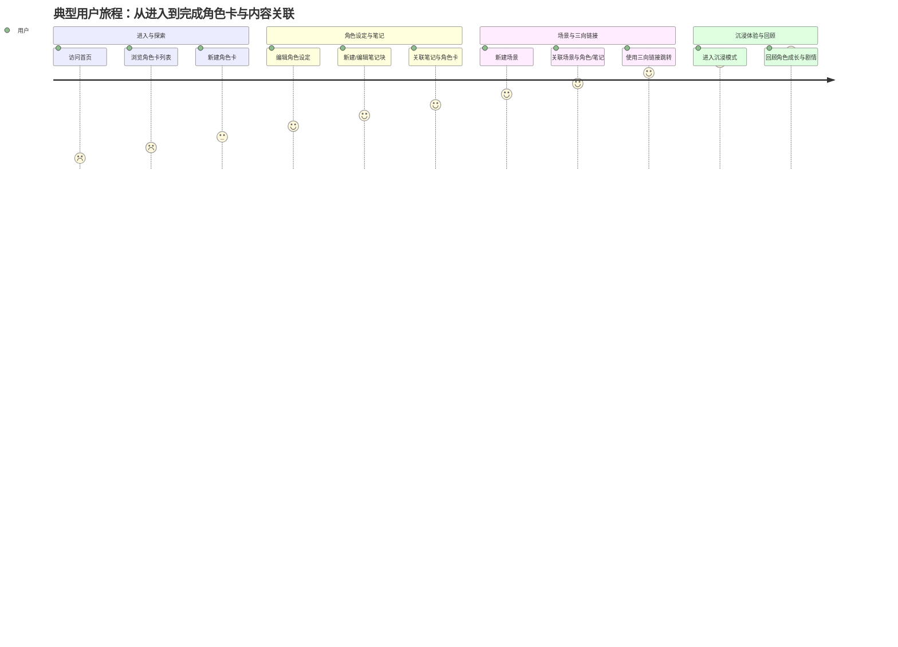

# 《冒险纪录》产品需求文档（PRD）

## 一、产品定位与目标
- **产品名称**：《冒险纪录》
- **目标用户**：TRPG玩家，尤其是有原创角色（OC）创作和沉浸式扮演需求的用户
- **核心价值**：无规则依赖，专注于角色卡设定、剧情与扮演记录，提升沉浸感
- **版本定位**：首版MVP仅支持角色卡、笔记块、场景三者的自由关联与沉浸式记录

## 二、目标与成功指标（OKR/KPI）
- O1：上线首月获取100名核心TRPG玩家注册并活跃
- O2：用户平均每周新增3条以上角色笔记/设定
- O3：用户反馈沉浸感与自由度满意度≥80%

## 三、用户痛点与Persona
### 1. Jobs-to-Be-Done
- 记录原创角色的背景、设定、成长轨迹
- 关联剧情笔记、NPC、场景等内容，方便回顾与扮演
- 支持跨规则、跨剧本的角色复用与沉浸体验

### 2. Persona
- **A. 沉浸派玩家小林**：热衷于角色扮演，喜欢写长篇设定和剧情日记
- **B. 规则轻度玩家阿明**：不关心数值，更注重故事和角色成长
- **C. 剧本创作者小雪**：经常设计OC并在不同团本中复用

## 四、功能列表与三向链接
| 功能模块   | 描述 | 关联对象 |
|------------|------|----------|
| 角色卡管理 | 创建/编辑OC角色卡，支持文本、图片、标签 | 笔记块、场景 |
| 笔记块     | 剧情、设定、灵感等自由笔记 | 角色卡、场景 |
| 场景管理   | 记录重要地点、事件、NPC等 | 角色卡、笔记块 |
| 三向链接   | 任意内容块可相互引用、跳转 | 角色卡、笔记块、场景 |
| 沉浸模式   | 无干扰、全屏沉浸式记录体验 | - |

## 五、核心用户故事（User Story）
- 作为一名TRPG玩家，我希望能自由记录角色设定与剧情笔记，并能随时关联场景和其他内容，以便更好地扮演和回顾。
- 一名OC创作者，我希望我的角色卡能在不同剧本和场景中复用，且所有相关笔记都能一目了然。

## 六、初步界面流程（User Flow）
1. 首页：角色卡列表 → 进入角色详情
2. 角色详情：展示角色设定、相关笔记、场景链接
3. 新建/编辑笔记块：可选择关联角色或场景
4. 场景页：展示场景描述、相关角色与笔记
5. 沉浸模式：聚焦单一内容块编辑

## 七、MVP定义与里程碑
- **MVP范围**：角色卡管理、笔记块、场景管理、三向链接、沉浸模式
- **核心假设**：用户愿意为无规则、沉浸式的角色记录工具付出持续使用成本
- **度量指标**：日活跃用户数、笔记/角色卡创建量、内容块关联数
- **上线里程碑**：
  - PRD与原型完成
  - MVP开发与内测
  - 首批用户反馈与迭代

## 八、验证计划
- 用户访谈脚本：
  - 你目前如何记录TRPG角色与剧情？
  - 你觉得哪些功能最能提升你的沉浸感？
  - 你希望角色卡与笔记、场景之间如何关联？
- 可用性测试方案：
  - 观察用户新建角色卡、笔记、场景并建立链接的流程
  - 收集沉浸模式下的使用反馈

## 九、竞品/市场扫描
- Zhihu/Bili等平台用户自制表格/笔记
- 现有TRPG工具多依赖规则，缺乏沉浸式自由记录

## 十、用户旅程/流程图
### 1. 典型用户旅程（User Journey）

### 2. 核心界面流程（User Flow）
- **首页**
  - 查看角色卡列表
  - [新建角色卡] → 进入角色卡编辑页
- **角色卡详情页**
  - 展示角色设定、相关笔记、场景链接
  - [新建/编辑笔记] → 选择关联角色/场景
  - [跳转至场景页]
- **笔记块编辑页**
  - 输入剧情/设定/灵感内容
  - 选择关联对象（角色卡/场景）
- **场景页**
  - 展示场景描述、相关角色与笔记
  - [新建/编辑场景] → 选择关联角色/笔记
- **三向链接**
  - 任意内容块可插入引用，点击跳转至目标内容
- **沉浸模式**
  - 聚焦单一内容块编辑，隐藏干扰元素

> 注：流程图采用Mermaid语法，建议配合支持渲染的工具查看。

---
> 所有结论基于用户调研与竞品分析，后续将持续迭代完善。